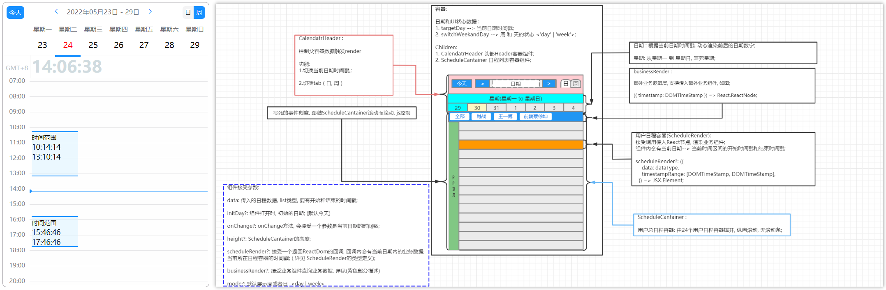

# <center> Calendar-react-ts



## 背景
本组件是采用`React` + `Typescript`开发的轻量化日程组件，起初只是应用在公司内部项目查中询面试官面试日程的功能中。当时接到需求时，线上找了一些插件，功能上多数都并不如意。于是决定自己开发一个类似的组件，分享供大家使用。

## 特点
本组件为一个轻量化的`React`日程组件，只依赖`moment`插件，开箱即用，无二次封装而外的依赖库；

## 功能
 1. 以天为维度查询日程数据；
 2. 日程模块高度，根据时间范围的大小，自动展示相应比例的高度；
 3. 拖动指定日程模块，改变该日程时间；
 4. 拖动日程模块下边缘，改变日程时间范围；

## 技术栈
 - `react --------> @18.1.0`
 - `react-dom ----> @18.1.0`
 - `typescript ---> @4.6.4`
 - `moment -------> @2.29.3`

## 安装

### 要求
本地需要配置nodejs环境，根据不同操作系统配置[配置nodejs环境](https://nodejs.org/en/download/)。

### npm安装

```git
$ npm i calendar-react-ts
```

### yarn安装
未配置`yarn`环境需要[全局安装`yarn`](https://classic.yarnpkg.com/en/docs/install#windows-stable).

```git
$ yarn add calendar-react-ts
```

## 本地开发

```git
$ git clone git@github.com:wangzi6224/calendar-react-ts.git
$ cd  calendar-ts
$ npm install
$ npm run start
```

## 用法

```tsx
import React, { useEffect, useState } from "react";
import moment from "moment";
import Calendar from "calendar-react-ts";

const initialList = [{
  id: 1,
  startTime: Date.now() - 3600 * 1000,
  endTime: Date.now() + 3600 * 1000
}];

const ScheduleRender: React.FC<{data: dataType, timestampRange: timestampRange}> = ({data, timestampRange}) => {
  return (
    <div style={{width: '90px', fontSize: "14px"}}>
      <span style={{fontSize: "12px"}}>时间范围</span>
      <div>{moment(data.startTime).format('HH:mm:ss')}</div>
      <div>{moment(data.endTime).format('HH:mm:ss')}</div>
    </div>
  );
};

const Page: React.FC = () => {
  const [scheduleList, setScheduleList] = useState<typeof initialList>(initialList);
  const [scheduleDate, setScheduleDate] = useState<number>(new Date().getTime());

  const slideChangeHandle = (currTimestamp: any[], data: { id: number; }) => {
    setScheduleList(
      scheduleList.map((item) => item.id === data.id ? ({
        ...item,
        startTime: currTimestamp[0],
        endTime: currTimestamp[1]
      }) : item)
    );
  };

  return (
    <div>
      <Calendar
        mode='week'
        isDraggable
        data={scheduleList}
        renderItemWidth={60}
        initDay={scheduleDate}
        onChange={setScheduleDate}
        onSlideChange={slideChangeHandle}
        businessRender={(timestamp: number) => <div>businessRender: {timestamp}</div>}
        scheduleRender={({ data, timestampRange }) => <ScheduleRender data={data} timestampRange={timestampRange}/>}
      />
    </div>
  );
};
```

## API
|      Fields      | Description                             |  Required  | Type                                                                                                        |
|:----------------:|-----------------------------------------|:----------:|-------------------------------------------------------------------------------------------------------------|
|       mode       | mode字段，是默认展示以周或者日维度查询日程的方式              |     no     | `week &#124; day`                                                                                           |
|   isDraggable    | 是否支持拖拽功能，默认`false `                     |     no     | `Boolean`                                                                                                   |
|       data       | 日程数据列表，`startTime`开始时间，`endTime`结束时间    |    yes     | `Array<{startTime: number; endTime: number;}>`                                                              |
|     initDay      | 初始化时间戳，默认为当前时间戳                         |     no     | `number`                                                                                                    |
|     onChange     | 切换日期时的回调方法，参数是当前切换的时间戳                  |     no     | `(timestamp: number) => void;`                                                                              |
|  onSlideChange   | 当滑拖拽日程，改变日程开始时间或日程时间范围是触发               |     no     | `(currTimestamp: [number, number], data: {startTime: number; endTime: number;}) => void;`                   |
|  businessRender  | 传入一些自定义的业务组件                            |     no     | `(timestamp: number) => React.ReactNode;`                                                                   |
|  scheduleRender  | 每一个渲染的日程的内部UI组件，可以自定义一下展示的元素或者点击事件等交互行为 |     no     | `(props: {data: {startTime: number; endTime: number;} ; timestampRange: [number, number]}) => JSX.Element;` |
|  renderItemWidth  | 每一个渲染的日程UI组件的宽度 |     no     | `number` |

## License

Calendar-ts is open source software licensed as [MIT](https://github.com/wangzi6224/calendar-react-ts/blob/master/LICENSE).
